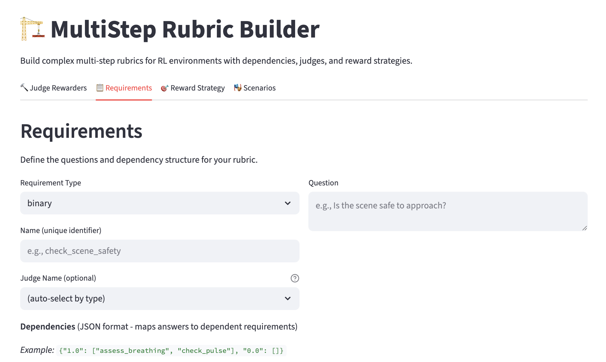
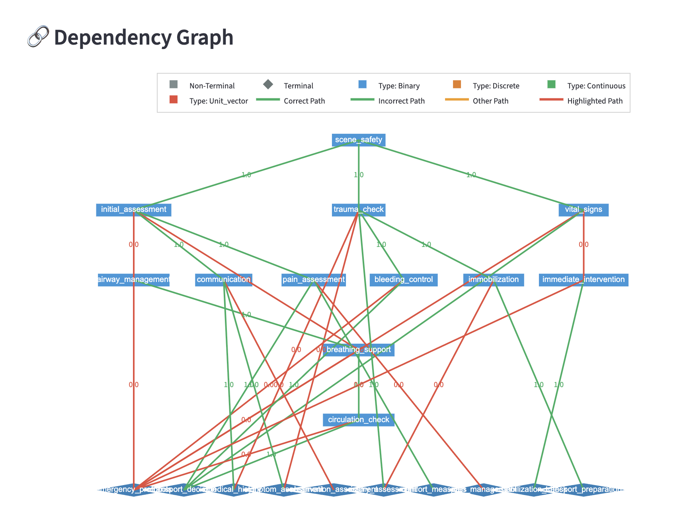

# OpenRubric: Multi‑Step Rubric Evaluation

[](https://www.python.org/downloads/)
[](https://opensource.org/licenses/MIT)

OpenRubric is a multi-step rubric evaluation framework built on top of [verifiers](https://github.com/willccbb/verifiers). OpenRubric is built on the idea that real-world problems are typically full of branching logic, and that single-step rubric evaluation is insufficient for evaluating complex problems. OpenRubric extends `verifiers` to support multi-step rubrics that can mix judges and verifiable rewards in single- or multi-turn scenarios. 

We also develop a synthetic data generation pipeline that can generate hidden descriptions and full scenarios from any rubric. Additionally, we create a GUI builder for rubrics that can be used to create and edit rubrics for easier access for researchers. Finally, we show example training runs using OpenRubric on PrimeIntellect nodes.

Most functionality is built into `verifiers/rubrics/multistep/` and `verifiers/envs/multistep_env.py`. `multistep_extras/` contains tools for developing and visualizing rubrics, generating synthetic data, example rubrics, and training on PrimeIntellect.

## Features

- **Branching rubrics**: Requirements connected as a DAG; paths advance on correct judgments
- **Judge‑driven progression**: External judge determines correctness and reveals next steps
- **Flexible scoring**: Level‑weighted, progressive, mean, sum, and more
- **GUI builder**: Visual editor and YAML import/export
- **Synthetic data**: Generate hidden descriptions and full scenarios; optional HF Hub push
- **Training**: Example training runs using OpenRubric on PrimeIntellect

## Installation
<details>
<summary>Click to expand</summary>

```bash
git clone https://github.com/jacobphillips99/open-rubric.git
cd open-rubric
uv sync --extra all

# Optional: GPU‑optimized attention
uv pip install flash-attn --no-build-isolation
```

Configure credentials as needed (`OPENAI`, `ANTHROPIC`, `wandb`, `huggingface-cli`). For remote setup, see `install.sh`.

</details>


## Core Concepts

- **[MultiStepRubric](https://github.com/jacobphillips99/open-rubric/blob/main/verifiers/rubrics/multistep/multistep_rubric.py)**: A DAG of named requirements mixing judges and verifiable rewards
- **[MultiStepMultiTurnEnv](https://github.com/jacobphillips99/open-rubric/blob/main/verifiers/envs/multistep_env.py)**: A turn-based environment that progressively reveals information as Requirements are satisfied
- **[Requirement](https://github.com/jacobphillips99/open-rubric/blob/main/verifiers/rubrics/multistep/requirement.py)**: A question to evaluate model responses (such as binary or discrete/continuous), with conditional dependencies
- **[Scenario](https://github.com/jacobphillips99/open-rubric/blob/main/verifiers/rubrics/multistep/scenario.py)**: Prompt + model completion + ground‑truth answers with an optional hidden seed description
- **[Judge](https://github.com/jacobphillips99/open-rubric/blob/main/verifiers/rewards/judge_reward.py)**: Scores a requirement given the prompt/completion/answer
- **[Reward strategy](https://github.com/jacobphillips99/open-rubric/blob/main/verifiers/rubrics/multistep/reward_strategies.py)**: Aggregates per‑requirement results into a single score

## Quick Start

Minimal branching example with two paths and an async evaluation call you can run directly.

First, setup the `Requirement` objects, which contain conditional dependencies and a question to evaluate.

```python
# Define a tiny workflow
requirements = [
    BinaryRequirement(
        name="scene_safety",
        question="Does the response prioritize scene safety before approaching?",
        dependencies={
            1.0: ["patient_consciousness"],
            0.0: [],
        },
    ),
    BinaryRequirement(
        name="patient_consciousness",
        question="Does the response assess if the patient is conscious?",
        dependencies={
            1.0: ["communication"],
            0.0: ["airway_management"],
        },
    ),
    BinaryRequirement(name="communication", question="Do they communicate with the patient?"),
    BinaryRequirement(name="airway_management", question="Do they secure the airway?"),
]
```

Next, we create a `MultiStepRubric` container, which organizes the requirements into a DAG and adds judge and verifiable reward objects.

```python
rubric = MultiStepRubric(requirements, [BinaryJudgeRewarder(JUDGE_PROMPT)])
```

We then create a `Scenario` object, which contains a prompt, model completion, and ground-truth answers.

```python
scenario = Scenario(
    prompt="You arrive at a minor crash; the scene is safe.",
    completion="I confirm safety, speak to the patient, and proceed.",
    answers={
        "scene_safety": {"answer": 1.0},
        "patient_consciousness": {"answer": 1.0},
        "communication": {"answer": 1.0},
    },
)
```

Now we can create a `Environment` object, which contains all the information and logic for evaluating the scenario according to a model completion and rubric. 

```python 
env = MultiStepMultiTurnEnv(multistep_rubric=rubric)
completion, state = env.rollout(client, model, prompt, answer, kwargs)
scores = rubric.score_rollout(prompt, completion, answers, state)
```

The environment queries a policy model to get the model completion. The model completion is then evaluated according to the rubric.

## Workflow Builder (GUI)

It can be difficult to create and edit rubrics by hand. To make this easier, we have created a GUI builder that can be used to create and edit rubrics. Simply run the following command to start the builder:

```bash
streamlit run multistep_extras/builders/rubric_gui.py
```

The builder supports visual editing, judge configuration, reward strategy selection, and YAML import/export.



The sidebar allows you to load and save rubrics, and the main panel allows you to build judges, create requirements, compare reward strategies, and even develop new scenarios. We also visualize the paths through the rubric and examine initial, branching, and terminal states.



## Synthetic Data Generation

Generate scenarios from any rubric. See `multistep_extras/synthetic/README.md` for details.

Outputs include two splits: `hidden` (hidden descriptions) and `scenarios` (full scenarios). Local JSONL files are written under `outputs/hf/`.

## Training on Prime Intellect

We adapt the train examples from `verifiers` and train better rubric-following policy models. We focus on training for the `first_responder` rubric, which simulates a complex, real-world difficult medical decision-making framework. Following the instructions in [`verifiers/`](https://github.com/willccbb/verifiers/blob/main/README.md#training-on-prime-intellect), we reccomend renting Prime Intellect nodes.

Tips and Tricks:
- `ssh -A` to forward your local SSH agent to the remote node
- `NCCL_SHM_DISABLE=1 NCCL_DEBUG=INFO NCCL_P2P_DISABLE=1` to avoid NCCL issues and for easier debugging
- Don't forget to set `OPENAI_API_KEY` and `WANDB_API_KEY`


For setup: 
```bash
git clone https://github.com/jacobphillips99/open-rubric.git
cd open-rubric
chmod +x install.sh
./install.sh
```

One-shot setup: installs `uv` and basic tools, configures tmux, installs project dependencies (optional `flash-attn`), and installs OpenRubric.


## Citation

```bibtex
@software{openrubric2025,
  title={OpenRubric: Multi-Step Rubric Evaluation Framework},
  author={Phillips, Jacob},
  year={2025},
  url={https://github.com/jacobphillips99/open-rubric}
}
```

## Acknowledgments
This project was developed by [Jacob Phillips](https://jacobdphillips.com) as a part of the [Andreessen Horowitz American Dynamism Engineering Fellows program](https://a16z.com/the-american-dynamism-engineering-fellows-program/). Special thanks to the American Dynamism team for their support and feedback on the project.

OpenRubric is built on top of [verifiers](https://github.com/willccbb/verifiers) by Will Brown. Thank you to Will and the rest of the PrimeIntellect team for open-sourcing their work.

If using OpenRubric in your work, please cite it to acknowledge the authors. Suggested format:

```bibtex
@software{openrubric2025,
    title = {OpenRubric: Multi-Step Rubric Evaluation Framework},
    author = {Jacob Phillips},
    url = {https://github.com/jacobphillips99/open-rubric},
    version = {insert version number},
    date = {insert date of usage},
    year = {2025},
}
```